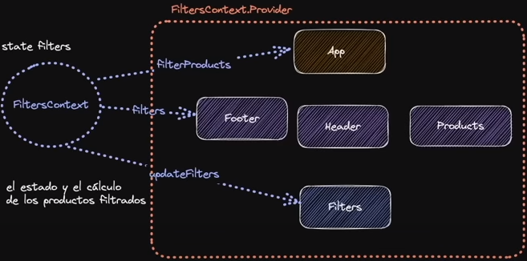

# React
## Required
A list of React components or html elements that is defined in a recursion, like the shown in the following snippet of code:

```jsx title="Wrong listing of React elements/components"
movies.map(x => (
    <li ...>
    ...
    </li>
))
```

requires a `key` property with an unique identifier. In the example above, we would require to change the `<li>` element like this:

```jsx title="Correct listing of React elements/components"
movies.map(x => (
    <li key={uniqueID} ...>
    ...
    </li>
))
```

## Syntax

`...props`

When passing `...whatevername` to a React component it is a way of specifying variable number of parameters to the component. It can be used, for example, to pass props to a specific html element to customize its style as in the next example:

??? example "... syntax"

    ``` jsx
    // Create the component
    export function MyComp({a, b, ...props}) {
        //Functionality
        return <a {...props}>
    }
    
    <MyComp a="MyPropA" b="MyPropB" className={bg-slate-200}>
    ```

## Methods

`lazy`

Allows to dynamically import components, so that if they are not needed (in use) they are not rendered.

## Components

`Suspense`

Enclose the components loaded with `lazy`.

## Hooks
`#!jsx useState()`

Holds something (can be an object, an array,...), that when changed by the the setter function, renders the component.

!!! example "useState good example"
    ```jsx
    const [count, setCount] = React.useState(0)
    const incrementCount = () => setCount((previousCount) => previousCount + 1)
    // Last line is equivalent to:
    const incrementCount = () => setCount(count + 1)
    ```

In the example above, the feature of passing a function to the `useState` whose argument is the last value of the state, is called **functional update**.

`#!jsx useRef()` 

Can be used to have a mutable reference to an HTML element. It works similarly to `#!jsx useState` but doesn't render again the component when its `.current` property, holding the saved value, change.

??? example "useRef example"

    ``` jsx
    const inputRef = useRef()
    <input ref={useRef}></input>
    ```

`#!jsx useMemo()`

Will execute its body only when the list of dependencies has changed. This could be done also by combining the `useEffect` and the `useRef` hooks.

`#!jsx useCallback()` 

Is like an `useMemo` but for defining a function. Internally it makes use of `useMemo`.

??? example "useCallback example"

    ``` jsx
    useCallback()
    ```

`#!jsx useId()`

Will create an unique ID based on the order in which the components are called.

`#!jsx useContext()`

In the figure below, the React components `Footer` and `Filters` require states and functions from a custom hook. If children components of require the same states and functions, we will have to keep passing them through the props of each child component. This is known as prop drilling. 

The `useContext()` hook avoids this situation

<figure markdown="span">
  { width="600" }
  <figcaption>illustration of useContext in the shopping cart tutorial developed by midudev</figcaption>
</figure>

Figure retrieved from [^7].

Below is shown an example of usage of `useContext()`. 

!!! example "useContext() usage example part 1"
    ```jsx
    import { createContext } from 'react'
    // Creates the context to be consumed
    export function NameOfContext = createContext()
    // Creates the Provider giving access to shared data
    export function MyComponent ({children}){
        <NameOfContext.Provider value={{dataToShare}}>
        {children}
        </NameOfContext.Provider>
    }
    ```

The two previous steps have to be completed by, what is known as *consuming the context*:

!!! example "useContext() usage example part 2""
    ```jsx
    import { NameOfContext } from 'path/to/context'
    // This will access the data shared by the context
    const accessSharedData = useContext(NameOfContext)
    ```

Also, the component should encapsulate all the components or elements that require to access the shared data.

!!! example "useContext() usage example part 3""
    ```jsx
    import { MyComponent } from 'path/to/component'
    // This will access the shared data by the context
    <MyComponent>
        {//Everything that is encapsulated here will have access to the data shared by the context}
    </MyComponent>
    ```
It is either convenient (or required - *to be checked* -) to create a custom hook to use the context. If that is the case, the custom hook must be called from within the context provider component (any component encapsulated by it).

Use cases:
If used to share a global state, `useContext()` is thought to be used when the states are small or are not called too often (i.e. user session).

[^7]: [Tienda y Carrito con React + Estado Global con useContext + Manejo de estado con useReducer](https://www.youtube.com/watch?v=B9tDYAZZxcE&t=2628s)

`#!jsx useReducer()`

Receives an initial state and a callback to perform on different types of actions. As in the ``useState()`` method, the state can be anything. The action can be an object whose elements are the action name (or an action identifier, i.e. a string identifying the action to perform) and the action payload (or the information, in the form of an object, array, ..., to be used for each action identifier).

It is defined as follows:

!!! example "useReducer() usage"
    ```jsx
    const [state, dispatch] = useReducer(reducer, initialState)

    const addToCart = (product) =>{
        dispatch({
            type: 'ADD_TO_CART'  // Action identifier
            payload: product
        })
    }
    ```


The following two code snippets show a comparisson between three functionalities of a Shopping Cart application, with and without the reducer.

??? example "Example functionalities without the useReducer()"
    ```jsx
    const addToCart = (product) => {
        const productInCart = cart.findIndex((entry)=> entry.id === product.id)

        if (productInCart >= 0) {
            const newCart = structuredClone(cart)
            newCart[productInCart].quantity += 1
            return setCart(newCart)
        }
        setCart((previousState) => ([
            ...previousState,
            {
                ...product,
                quantity: 1
            }
        ]))
    }
    const clearCart = () => {
        setCart([])
    }
    const removeFromCart = (product) => {
        setCart(previousState => previousState.filter(entry => entry.id !== product.id))
    }
    ```

??? example "Example functionalities with useReducer()"
    ```jsx
    const reducer = (state, action) => {
    const {type: actionType, payload: actionPayload} = action
    const { id } = actionPayload

    switch (actionType) {
        case "ADD_TO_CART": {        
            const productInCartIndex = state.findIndex((entry)=> entry.id === id)
            if (productInCartIndex >= 0) {
                const newState = structuredClone(state)
                newState[productInCartIndex].quantity += 1
                return newState
            }
            return [
                ...state,
                {
                    ...actionPayload,
                    quantity: 1
                }
            ]
        }
        case "REMOVE_FROM_CART": {
            return state.filter((entry) => entry.id !== id)
        }
        case "CLEAR_FROM_CART": {
            return initialState
        }            
    }
    return state
    }
    ```